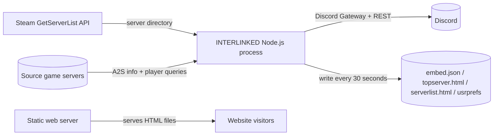
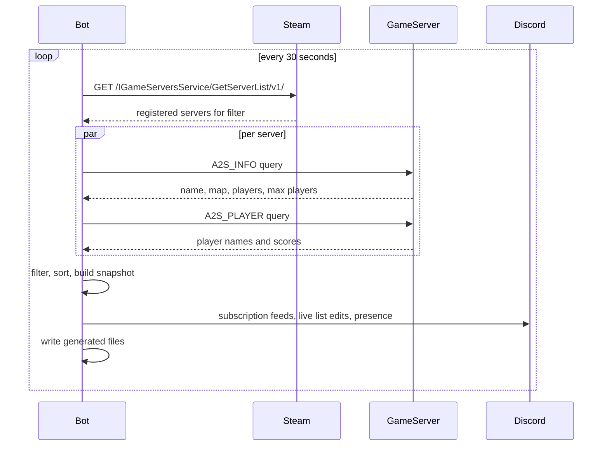

# INTERLINKED Production Documentation

**Source:** [GleammerRay/INTERLINKED](https://github.com/GleammerRay/INTERLINKED)  
**Documented revision:** `v8.0.5` (`2ba46c0`)  
**Audience:** Self-hosting operators, backend engineers, and Discord bot maintainers  
**Technical depth:** Operational overview plus implementation-level reference  

This document describes the behavior of INTERLINKED as observed from its source. It is generated documentation, not an upstream official guide.

---

## 1. Overview & Purpose

INTERLINKED is a Node.js Discord bot that discovers live Source-engine game servers and publishes their state to Discord and static web artifacts.

The core value proposition is that one small bot can:

- Discover servers through Steam's central game server directory instead of maintaining a manual IP list.
- Validate each server directly over A2S so lists contain reachable, current information.
- Present the result as Discord embeds, subscription feeds, role pings, and interactive server-list messages.
- Produce `embed.json`, `topserver.html`, and `serverlist.html` so the same data can be embedded on a website.
- Support any Source game or mod by changing a filter in `config.json`.

INTERLINKED does not run its own game servers, does not expose an HTTP API, and does not react to live join/leave events. It polls Steam every 30 seconds and publishes the resulting snapshot.

## 2. Architecture & Prerequisites

### 2.1 System Diagram



### 2.2 Discovery Sequence



### 2.3 Prerequisites

| Requirement | Notes |
| --- | --- |
| Node.js | The project uses ES modules and modern syntax; Node.js 18 or newer is recommended. |
| npm | Required for `npm ci`. |
| Discord bot token | Created in the Discord Developer Portal under your application's Bot section. |
| Steam Web API key | Obtained from https://steamcommunity.com/dev/apikey. |
| Network access | Bot needs outbound access to Steam, Discord, and game servers. |
| Game server reachability | Servers must respond to A2S queries over UDP. |

### 2.4 Dependencies

| Package | Purpose |
| --- | --- |
| `steam-server-query` | A2S info and player queries. |
| `ws` | Discord Gateway WebSocket client. |
| `xmlhttprequest` | Discord REST requests. |

### 2.5 Repository Layout

```text
INTERLINKED/
├── .config.json              # Configuration template
├── .topserverstyle.css       # Stylesheet for generated HTML
├── start_bot.js              # Entry point and CLI wrapper
├── lib/
│   ├── interlinked.js        # Core bot, discovery, Discord logic
│   ├── gleamcord.js          # Minimal Discord REST/Gateway client
│   ├── webtoys.js            # HTML generation
│   ├── interlinked_db.js     # File-backed JSON cache
│   ├── burst_stack.js        # Batched async dispatch helper
│   ├── commands.js           # Command initialization types
│   └── commands/
│       ├── player_queue.js   # Player queue command
│       └── template          # Example command plugin
└── assets/                   # Logos and artwork
```

## 3. Quickstart / Setup Guide

### 3.1 Create the Discord Bot

1. Create an application at https://discord.com/developers/applications.
2. Open the Bot section and generate a token.
3. Use the OAuth2 URL generator with the `bot` scope and permissions to send messages and manage roles.
4. Invite the bot to a Discord server.

### 3.2 Create the Steam API Key

1. Visit https://steamcommunity.com/dev/apikey.
2. Create a key associated with a domain.
3. Store it in the bot configuration; do not commit it to source control.

### 3.3 Configure and Run

```bash
cd /home/codex/INTERLINKED
cp .config.json config.json
npm ci
```

Edit `config.json` with at least:

```json
{
  "discordBotToken": "your-discord-bot-token",
  "steamAPIKey": "your-steam-api-key",
  "steamAppID": "215",
  "steamGameDir": "insurgency",
  "gameName": "IMIC"
}
```

Run:

```bash
node start_bot.js
```

Expected first-run behavior:

- `usrprefs.json` is created if missing.
- The bot connects to Discord if a token is set.
- The first Steam refresh runs immediately, then every 30 seconds.
- `embed.json`, `topserver.html`, and `serverlist.html` are written after each refresh.

### 3.4 Production Process Management

Run the bot as a dedicated user with systemd:

```ini
[Unit]
Description=INTERLINKED Discord bot
After=network-online.target
Wants=network-online.target

[Service]
User=interlinked
WorkingDirectory=/opt/interlinked
ExecStart=/usr/bin/node start_bot.js --raw
Restart=on-failure
RestartSec=5

[Install]
WantedBy=multi-user.target
```

`--raw` is used because systemd is already providing process supervision; this avoids double logging through the wrapper.

### 3.5 Serve the Generated Pages

The bot does not listen on a port. Serve the directory with any static web server:

```bash
cd /home/codex/INTERLINKED
python3 -m http.server 8080
```

For production, point nginx or Caddy at the directory containing `topserver.html`, `serverlist.html`, and `.topserverstyle.css`.

## 4. Detailed Reference / Specifications

### 4.1 Configuration Schema

| Field | Type | Required | Default | Description |
| --- | --- | --- | --- | --- |
| `dbPath` | string | Optional | `"usrprefs"` | Directory for command data such as player queues. |
| `discordBotToken` | string | Recommended | `""` | Discord bot token. Empty disables Discord connectivity but keeps file generation. |
| `outputEmbedJSONPath` | string | Optional | `"embed.json"` | Output path for Discord embed JSON. |
| `topServersHTMLStylePath` | string | Optional | `".topserverstyle.css"` | CSS file for the top-server page. |
| `outputTopServersHTMLPath` | string | Optional | `"topserver.html"` | Output path for the top-server page. |
| `serverListHTMLStylePath` | string | Optional | `".topserverstyle.css"` | CSS file for the server-list page. |
| `outputServerListHTMLPath` | string | Optional | `"serverlist.html"` | Output path for the server-list page. |
| `steamAPIKey` | string | Required | none | Steam Web API key. |
| `steamAppID` | string | Required if no `steamGameDir` | `"244630"` | Steam application ID. |
| `steamGameDir` | string | Optional | `""` | Source game directory, e.g. `"insurgency"`. |
| `steamGameTypes` | object | Optional | `{"all": []}` | Gametype filters; only the `all` array is used. |
| `gameName` | string | Required | `"NEOTOKYO°"` | Display name in embeds and HTML. |
| `logoURL` | string | Optional | `"default"` | Logo URL; `"default"` resolves to the project logo. |
| `gameListURL` | string | Optional | `"default"` | Undead Games Hub JSON URL for `/game_list`; `"default"` resolves to the official hub file. |
| `activeImageURLs` | string[] | Optional | NEOTOKYO image set | Random embed images. |
| `fridayImageURLs` | string[] | Optional | same as active | Images used on Fridays. |
| `mapImageURLs` | object | Optional | NEOTOKYO map set | Map name to image URL mapping. |

### 4.2 Steam Discovery Endpoint

INTERLINKED calls the Steam Web API as a client. It does not expose this as its own endpoint.

| Property | Value |
| --- | --- |
| Method | `GET` |
| URL | `https://api.steampowered.com/IGameServersService/GetServerList/v1/` |
| Authentication | `key` query parameter |
| Filter format | Backslash-separated key/value pairs |

Example request:

```bash
curl -G 'https://api.steampowered.com/IGameServersService/GetServerList/v1/' \
  --data-urlencode 'key=STEAM_API_KEY' \
  --data-urlencode 'filter=appid\215\gamedir\insurgency'
```

Representative response:

```json
{
  "response": {
    "servers": [
      {
        "addr": "203.0.113.10:27015",
        "gmsindex": 100,
        "steamid": "90000000000000000",
        "name": "Example IMIC Server",
        "appid": 215,
        "gamedir": "insurgency",
        "version": "1.0.0.0",
        "product": "insurgency",
        "region": 255,
        "players": 5,
        "max_players": 32,
        "bots": 0,
        "map": "ins_sinjar",
        "secure": true,
        "dedicated": true,
        "os": "l",
        "type": "d",
        "visibility": 0
      }
    ]
  }
}
```

### 4.3 A2S Validation

For every server returned by Steam, INTERLINKED runs `A2S_INFO` and `A2S_PLAYER` queries in parallel using `steam-server-query`.

| Field | Source | Description |
| --- | --- | --- |
| `addr` | Steam + A2S | `ip:port` address. |
| `name` | A2S | Server display name. |
| `map` | A2S | Current map name. |
| `players` | A2S | Current player count. |
| `max_players` | A2S | Maximum player count. |
| `visibility` | A2S | Visibility flag; `1` means private/passworded and is skipped. |
| `spectatorName` | A2S | Spectator identity used to filter the player list. |
| `playerInfo.players` | A2S | Player names, scores, and connection durations. |

Representative normalized server object after validation:

```json
{
  "addr": "203.0.113.10:27015",
  "name": "Example IMIC Server",
  "map": "ins_sinjar",
  "players": 5,
  "max_players": 32,
  "visibility": 0,
  "spectatorName": "TV",
  "playerInfo": {
    "players": [
      {
        "name": "PlayerOne",
        "score": 12,
        "time": 300.5
      },
      {
        "name": "PlayerTwo",
        "score": 8,
        "time": 120.0
      }
    ]
  }
}
```

### 4.4 Discord Slash Commands

#### User Commands

| Command | Options | Description |
| --- | --- | --- |
| `/help` | none | Lists available commands. |
| `/update` | none | Shows the current active server list. |
| `/pub` | none | Adds the ping role to the caller. |
| `/unpub` | none | Removes the ping role from the caller. |
| `/get` | variable name | Reads a per-guild variable. |

`/get` accepts: `all`, `admin_role`, `max_server_count`, `subscribed_channels`, `min_player_count`, `subscription_feed_min_rate`, `ping_role`, `ping_min_rate`, `ping_min_player_count`, `blacklist`.

#### Admin Commands

| Command | Options | Description |
| --- | --- | --- |
| `/reset` | variable name | Resets one or all variables. |
| `/set` | variable name + value | Sets a per-guild variable. |
| `/subscribe` | none | Subscribes the current channel to feed posts. |
| `/unsubscribe` | none | Unsubscribes the current channel. |
| `/blacklist` | `address` | Hides a server from this guild's lists. |
| `/unblacklist` | `address` | Removes a server from the guild blacklist. |
| `/server_list` | none | Posts a message the bot keeps updated. |
| `/game_list` | none | Posts Undead Games Hub list messages. |
| `/player_queue` | none | Opens the player queue panel. |

`/set` value options:

| Variable | Value Type | Notes |
| --- | --- | --- |
| `admin_role` | role | Role treated as admin. |
| `max_server_count` | integer | Maximum servers after filtering. |
| `min_player_count` | integer | Minimum players for subscription feed. |
| `subscription_feed_min_rate` | integer | Milliseconds between feed posts. |
| `ping_role` | role | Role mentioned for pings. |
| `ping_min_rate` | integer | Milliseconds between pings. |
| `ping_min_player_count` | integer | Minimum players for pings. |

### 4.5 Per-Guild Variables

| Variable | Default | Purpose |
| --- | --- | --- |
| `admin_role` | unset | Role treated as INTERLINKED admin. |
| `max_server_count` | 5 | Maximum servers included after blacklist filtering. |
| `subscribed_channels` | none | Channels receiving automatic feed posts. |
| `min_player_count` | 1 | Minimum total players before a feed post. |
| `subscription_feed_min_rate` | 1800000 ms | Minimum delay between feed posts (30 minutes). |
| `ping_role` | unset | Role mentioned when thresholds are met. |
| `ping_min_rate` | 3600000 ms | Minimum delay between pings (1 hour). |
| `ping_min_player_count` | 2 | Minimum total players before a ping. |
| `blacklist` | none | Server addresses hidden from this guild. |

### 4.6 Admin Semantics

An INTERLINKED admin is:

- Any Discord member with the **Administrator** permission on that server, or
- Any member holding the role configured as `admin_role`.

Discord's own integration permissions are an additional gate. Both the bot-level check and Discord's command permission settings must allow the command.

### 4.7 Generated Artifacts

#### `embed.json`

Raw Discord embed message JSON, not an HTML page. Representative shape:

```json
{
  "components": [
    {
      "type": 1,
      "components": [
        {
          "type": 2,
          "custom_id": "list_players",
          "label": "Show players",
          "style": 2
        }
      ]
    }
  ],
  "embeds": [
    {
      "title": "IMIC servers list",
      "description": "\n:desktop: Online servers: 1\n:hugging: Online players: 5\n\nActive servers:",
      "fields": [
        {
          "name": ":green_circle: Example IMIC Server",
          "value": "Players: **5/32**\nIP: `203.0.113.10:27015`\nMap: `ins_sinjar`"
        }
      ],
      "color": 4592387,
      "timestamp": "2026-08-15T00:00:00.000Z"
    }
  ],
  "content": ""
}
```

#### `topserver.html`

Static page showing the highest-population active server.

#### `serverlist.html`

Static page showing active servers first, then inactive servers, up to 15 entries.

Neither file is served by the bot itself.

### 4.8 Storage Schema

#### `usrprefs.json`

Serialized guild preferences:

```json
{
  "guilds": [
    {
      "guildID": "123456789012345678",
      "maxServerCount": 5,
      "adminRole": null,
      "subscribedChannels": [],
      "subscriptionFeedMinRate": 1800000,
      "minPlayerCount": 1,
      "pingRole": null,
      "pingMinRate": 3600000,
      "pingMinPlayerCount": 2,
      "blacklist": [],
      "serverListChannelID": null,
      "serverListMessageID": null,
      "gameListChannelID": null,
      "gameListMessageIDs": null,
      "gameListHash": null
    }
  ]
}
```

#### `usrprefs/`

Command data stored as JSON files under `usrprefs/`, for example `usrprefs/guilds/<guild_id>/player_queue.json`.

### 4.9 Library API

| Export | Purpose |
| --- | --- |
| `InterlinkedServer` | One game server. |
| `InterlinkedServerList` | Server collection plus active counts and totals. |
| `InterlinkedGuild` | Per-guild state and operations. |
| `InterlinkedDiscordJSON` | Serialized bot preferences. |
| `InterlinkedDiscord` | Bot preference operations across guilds. |
| `Interlinked` | Main bot class with `start()` and `stop()`. |

### 4.10 CLI Reference

| Flag | Description |
| --- | --- |
| `-h`, `--help` | Show help. |
| `-q`, `--quiet` | Suppress info/warning console output. |
| `-s`, `--save-log` | Write the log to `bot.log`. |
| `-o`, `--output <file>` | Custom log file path. |
| `-r`, `--restart` | Restart the child process on crash. |
| `--raw` | Run without wrapper formatting or restart handling. |

## 5. Edge Cases & Error Handling

| Condition | Behavior | Recovery |
| --- | --- | --- |
| `config.json` missing | Fatal log `F:Config not found under 'config.json'`, exit 1. | Create the file. |
| `config.json` invalid JSON | Fatal log with parse error, exit 1. | Fix JSON syntax. |
| `steamAPIKey` missing or empty | Fatal log, exit 1. | Add a valid Steam API key. |
| `discordBotToken` empty | Warning; bot skips Discord but still generates files. | Add token for Discord features. |
| No `steamAppID` and no `steamGameDir` | Constructor throws `Need valid steamAppID or steamGameDir to get a server request url`. | Configure one of them. |
| Steam API returns unexpected shape | Warning log, treated as an empty server list. | Check API key, quota, and filter. |
| A2S query fails or times out | Server is skipped for that refresh. | Verify the server is reachable and not firewalled. |
| Server is private/passworded | Skipped automatically. | Remove the password to make it visible. |
| Server name contains `[test]` or `[nodiscovery]` | Skipped automatically. | Rename to allow discovery. |
| Discord rate limit | REST client waits for `retry_after`. | None needed. |
| Role permission errors | Discord error codes `50001` / `50013` are handled with friendly messages. | Move bot role above the target role or grant permissions. |
| Pinned server-list message deleted | The bot continues trying to edit a stale message ID. | Re-run `/server_list` to create a new live message. |
| Generated file path not writable | File write throws; the async heartbeat may surface as an unhandled rejection. | Fix directory permissions and restart. |
| Process crash | Without supervision the process stays down. | Use `-r`, systemd, or a container supervisor. |

## 6. FAQ & Troubleshooting

### 6.1 The bot is not posting to subscribed channels

Check:

1. The channel is actually in `subscribed_channels` (`/get subscribed_channels`).
2. Total players are at or above `min_player_count`.
3. `subscription_feed_min_rate` has elapsed since the last post.
4. The servers are not all blacklisted or skipped during validation.

### 6.2 Slash commands are missing or denied

Check Discord Server Settings -> Integrations -> the bot and enable the commands for the appropriate roles/channels. Then check whether the caller has Discord Administrator permission or the `admin_role`.

### 6.3 My server does not appear in the list

Verify:

- `steamAppID` / `steamGameDir` matches what the server advertises.
- The server is visible in Steam's server browser.
- The server answers A2S queries from the bot's network.
- The server is not password-protected and does not contain `[test]` or `[nodiscovery]` in its name.

### 6.4 `topserver.html` does not load

The bot only writes files. Serve the directory with a static web server, and make sure the bot's working directory has write permission.

### 6.5 The bot shows no servers after a restart

The server snapshot is kept in memory only. The first refresh after startup repopulates it within 30 seconds. Persistent state such as guild preferences and player queues is stored in `usrprefs.json` and `usrprefs/`.

---

## Appendix: Source Map

| File | Responsibility |
| --- | --- |
| `start_bot.js` | CLI parsing, logging, process wrapper, config validation. |
| `lib/interlinked.js` | Discovery pipeline, Discord commands, server lists, generated files. |
| `lib/gleamcord.js` | Discord Gateway and REST client. |
| `lib/webtoys.js` | Static HTML generation. |
| `lib/interlinked_db.js` | File-backed JSON cache. |
| `lib/burst_stack.js` | Batched async command dispatch. |
| `lib/commands/player_queue.js` | Player queue command and button flow. |
